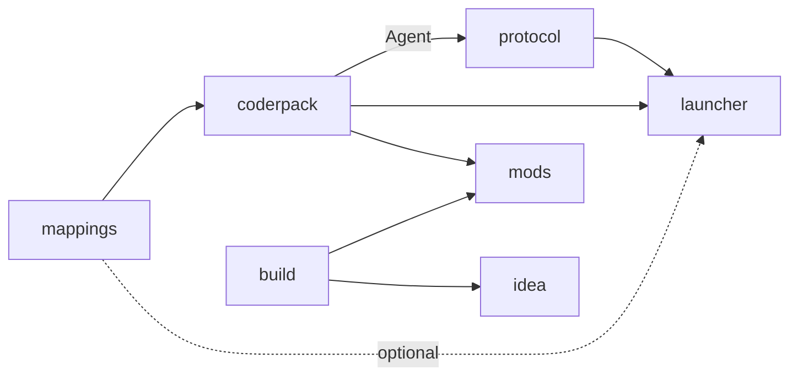

[Русский](CONTRIBUTING.md) · [English](CONTRIBUTING.EN.md)

# Mitentwickeln

Hier steht alles, was du für die Arbeit am Loader selbst brauchst: wie du an
die Quellen kommst, wie die Repositories voneinander abhängen und wie du sie
baust und veröffentlichst. Willst du nur einen Mod schreiben, brauchst du diese
Datei nicht. Fang mit der [README](README.DE.md) an.

## Quellen

Jedes Repository baut für sich allein. Willst du eine Komponente ändern, klon
nur diese:

```
git clone https://github.com/ancaria-dev/coderpack.git
```

Fehlende Nachbarn lädt der Build selbst herunter. `coderpack` holt
`mappings.json` in der Revision aus `.mappings-ref`. `protocol`, `launcher` und
`mods` legen im Wurzelverzeichnis eine `dependencies.json` ab, die genaue
Versionen fremder GitHub-Releases festlegt. „latest“ fragt niemand ab. Ein
kaputtes Release anderswo bricht deinen Build also nicht unangekündigt. `mods`
bezieht Plugin und API aus dem Gradle Plugin Portal und Maven Central, `idea`
die `coderpack`-Templates aus Maven Central.

Betrifft eine Änderung mehrere Repositories, check sie nebeneinander aus. Klon
dieses Repository und leg die übrigen unter ihren eigenen Namen hinein. Die
Builds finden ihre Nachbarn genau über diese Namen, und ein Nachbar-Checkout
hat immer Vorrang vor der festgelegten Version:

```
git clone https://github.com/ancaria-dev/.github.git ancaria
cd ancaria
for repo in mappings research coderpack protocol launcher build mods idea site; do
    git clone https://github.com/ancaria-dev/$repo.git
done
```

`ancaria.code-workspace` öffnet alle Ordner in einem VS-Code-Fenster.

## Wie die Repositories voneinander abhängen



Eine gestrichelte Kante ist optional. Der Graph hat keine Zyklen. `build` hängt
nicht von `coderpack` ab: Linter und Templates nutzen einen eigenen API-Stub.
Die CI von `coderpack` liest die Quellen von `build` und `launcher`, um die
Nummer des API-Vertrags abzugleichen – das ist eine Prüfung, keine
Abhängigkeit. `research` und `site` stehen außerhalb des Graphen.

## Bauen

| Repository | Befehl | Ergebnis |
|---|---|---|
| `mappings` | `python mappings.generator.py` | `mappings.json` mit den Adressen für den Agenten |
| `coderpack` | `gradlew build` | Die JARs `api`, `api-kotlin` und `zygote`. Die CI packt den Agenten zusätzlich als `agent.zip` |
| `protocol` | `cargo build --release` | `target/release/protocol.exe`, der Host mit eingebautem Agenten |
| `build` | `./gradlew build` in `gradle` | Gradle-Plugin, Linter und das Archiv mit dem Kommandozeilenwerkzeug `coderpack` |
| `launcher` | `pwsh tools/build.ps1` | `dist/Sacred Mod Loader.exe` mit eingebettetem Host und JARs |
| `mods` | `gradlew assembleSacredMod` | Vier vom Linter geprüfte Mods. `coderpack index` aktualisiert den Repository-Index |
| `idea` | `./gradlew buildPlugin` | Das Plugin-Zip in `build/distributions/` |
| `site` | `pnpm build` | Ein Ordner `dist/`. Die CI veröffentlicht ihn von `master` aus bei Cloudflare |

`research` hat keinen gemeinsamen Build. Dort liegen einzelne Skripte für
einzelne Untersuchungen. Jede Hook-Adresse stammt aus `mappings`, und
`research` hält fest, wie sie gefunden wurde.

## Versionen

Eine Versionsnummer steht an mehreren Stellen: in `gradle.properties`,
`Cargo.toml`, einer README, manchmal in einem Code-Kommentar. Vergisst du eine
davon, weicht das Release von der Doku ab.

Deshalb hat jedes Repository mit einer Version ein `tools/version.ps1`. Ohne
Argument gibt es die aktuelle Version aus, mit Argument schreibt es sie überall
auf einmal um:

```
pwsh tools/version.ps1
pwsh tools/version.ps1 0.200.1
```

Das Skript ändert nur die eigene Version des Repositorys. Festgelegte Versionen
fremder Releases in `dependencies.json` oder einem Gradle-Versionskatalog hebst
du in einem eigenen Commit an.

> [!NOTE]
> In `mods` hat jeder Mod seine eigene Version. `mods/tools/version.ps1` hebt
> alle vier auf einmal an, aber nur, wenn sie schon übereinstimmen. Sonst
> zeigt es alle Versionen und bricht ab. `plugin` und `api` in
> `gradle/libs.versions.toml` lässt es in Ruhe: Das sind Werkzeugversionen,
> keine Mod-Versionen.

## Releases

Die CI veröffentlicht ein Release, wenn es den Tag `v<Version>` noch nicht gibt,
und legt diesen Tag danach an. Für ein Release hebst du also die Version an.
Mods erscheinen einzeln unter Tags der Form `<id>-v<Version>`.

Eine Änderung erreicht Spieler nur über Releases der Repositories, die von ihr
abhängen. Was danach anzuheben ist:

| Was sich geändert hat | Was als Nächstes |
|---|---|
| `mappings` | Keine eigenen Releases. `coderpack` erzeugt `addr.js` neu und veröffentlicht, weiter wie beim Agenten |
| Der Agent in `coderpack` | Release von `coderpack`, Version in `protocol/dependencies.json` und Release von `protocol`, dann beide Versionen in `launcher/dependencies.json` und Release von `launcher` |
| `zygote` | Release von `coderpack`, Version in `launcher/dependencies.json` und Release von `launcher` |
| `api` oder `api-kotlin` | Release von `coderpack` und Publish in Central. Dann `apiVersion` in den Templates von `build`, `api` in `mods/gradle/libs.versions.toml` und die Version in `launcher/dependencies.json` |
| Nummer des API-Vertrags | Eine Änderung an drei Stellen: `Api.VERSION` in `coderpack`, `Verifier.API` in `build`, `mods.API` in `launcher`. Die CI von `coderpack` schlägt fehl, bis `build` und `launcher` gepusht sind, blockiert aber keine Veröffentlichung |
| `protocol` | Version in `launcher/dependencies.json` und Release von `launcher` |
| `build` | Release von `build` und Publish in Central. Dann `plugin` in `mods/gradle/libs.versions.toml`, die CLI-Version in `mods/dependencies.json` und `coderpack` in `idea/gradle/libs.versions.toml` |
| `launcher`, `idea`, ein Mod | Nichts: Von ihnen hängt nichts ab |
| `site` | Keine Releases. Die Beispiele auf der Seite aktualisierst du nach allen anderen Releases |

Läuft eine Änderung durch die ganze Kette, veröffentlichst du in dieser
Reihenfolge:

1. `mappings`
2. `coderpack`, danach Publish in Central
3. `build`, sobald das neue `api` in Central liegt, danach wieder Publish
4. `protocol` mit der neuen `coderpack`-Version
5. `launcher` mit den neuen Versionen von `protocol` und `coderpack`
6. `mods`, nach dem Publish aus Schritt 2 und 3
7. `idea`, sobald Central das POM der neuen `templates` ausliefert
8. `site`

Ein Upload in Central ist noch kein Release. Das Artefakt wird erst verfügbar,
wenn jemand im Portal auf Publish drückt. Bevor du die Version eines
Maven-Artefakts anhebst, frag deshalb dessen POM ab.
