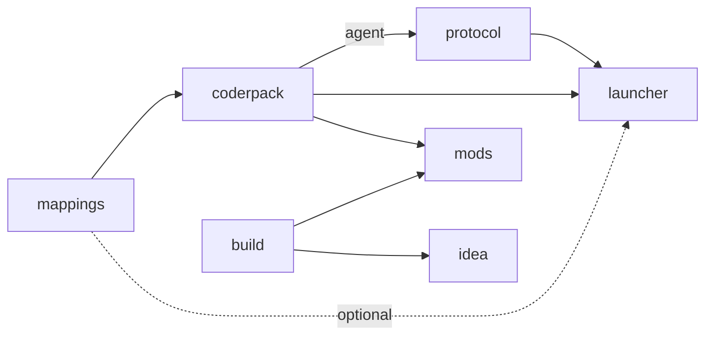

[Русский](CONTRIBUTING.md) · [Deutsch](CONTRIBUTING.DE.md)

# Contributing

This file covers work on the loader itself: getting the source, how the
repositories depend on each other, and how to build and release them. If you
want to write a mod, you don't need any of it. Start with the
[README](README.EN.md).

## Getting the source

Every repository builds on its own. To change one component, clone only that
one:

```
git clone https://github.com/ancaria-dev/coderpack.git
```

The build downloads whatever siblings are missing. `coderpack` fetches
`mappings.json` at the revision in `.mappings-ref`. `protocol`, `launcher`, and
`mods` keep a `dependencies.json` at their root that pins exact versions of
other repositories' GitHub releases. Nothing asks for “latest”, so a bad
release elsewhere can't break your build without warning. `mods` resolves the
plugin and API from the Gradle Plugin Portal and Maven Central, and `idea`
resolves the `coderpack` templates from Maven Central.

When a change spans several repositories, check them out side by side. Clone
this repository and put the others inside it under their own names. The
builds find their siblings by those names, and a sibling checkout always wins
over a pin:

```
git clone https://github.com/ancaria-dev/.github.git ancaria
cd ancaria
for repo in mappings research coderpack protocol launcher build mods idea site; do
    git clone https://github.com/ancaria-dev/$repo.git
done
```

`ancaria.code-workspace` opens every folder in one VS Code window.

## How the repositories depend on each other



A dashed edge is optional. The graph has no cycles. `build` doesn't depend on
`coderpack`: the linter and templates use their own API stub. `coderpack` CI
reads the `build` and `launcher` sources to compare the API contract number,
but that's a check, not a dependency. `research` and `site` stand outside the
graph.

## Building

| Repository | Command | Output |
|---|---|---|
| `mappings` | `python mappings.generator.py` | `mappings.json`, the addresses the agent uses |
| `coderpack` | `gradlew build` | The `api`, `api-kotlin`, and `zygote` jars. CI also packs the agent as `agent.zip` |
| `protocol` | `cargo build --release` | `target/release/protocol.exe`, the host with the agent built in |
| `build` | `./gradlew build` in `gradle` | The Gradle plugin, the linter, and the `coderpack` command-line archive |
| `launcher` | `pwsh tools/build.ps1` | `dist/Sacred Mod Loader.exe` with the host and jars embedded |
| `mods` | `gradlew assembleSacredMod` | Four linted mod jars. `coderpack index` updates the repository index |
| `idea` | `./gradlew buildPlugin` | The plugin zip in `build/distributions/` |
| `site` | `pnpm build` | A `dist/` folder. CI deploys it to Cloudflare from `master` |

`research` has no single build. It holds separate scripts for individual
investigations. Every hook address comes from `mappings`, and `research`
records how each one was found.

## Versions

A version number shows up in several places: `gradle.properties`,
`Cargo.toml`, a README, sometimes a code comment. Miss one and the release
drifts from its docs.

That's why every repository with a version has `tools/version.ps1`. Without an
argument it prints the current version. With one, it rewrites every spot at
once:

```
pwsh tools/version.ps1
pwsh tools/version.ps1 0.200.1
```

The script changes only the repository's own version. Raise pins on other
repositories' releases, in `dependencies.json` or a Gradle version catalog, in
a separate commit.

> [!NOTE]
> Each mod in `mods` has its own version. `mods/tools/version.ps1` raises all
> four at once, but only when they already match. Otherwise it prints every
> version and stops. It leaves `plugin` and `api` in
> `gradle/libs.versions.toml` alone: those are toolchain versions, not mod
> versions.

## Releases

CI publishes a release when the `v<version>` tag doesn't exist yet, then
creates that tag. To release, raise the version. Mods ship one at a time under
`<id>-v<version>` tags.

A change reaches players only through releases of the repositories that depend
on it. What to raise next:

| What changed | What to do next |
|---|---|
| `mappings` | No release of its own. `coderpack` regenerates `addr.js` and releases, then continue as for the agent |
| The agent in `coderpack` | A `coderpack` release, the pin in `protocol/dependencies.json` and a `protocol` release, then both pins in `launcher/dependencies.json` and a `launcher` release |
| `zygote` | A `coderpack` release, the pin in `launcher/dependencies.json`, and a `launcher` release |
| `api` or `api-kotlin` | A `coderpack` release and Publish in Central. Then `apiVersion` in the `build` templates, `api` in `mods/gradle/libs.versions.toml`, and the pin in `launcher/dependencies.json` |
| The API contract number | One edit in three places: `Api.VERSION` in `coderpack`, `Verifier.API` in `build`, `mods.API` in `launcher`. `coderpack` CI fails until `build` and `launcher` are pushed, but publishing still goes through |
| `protocol` | The pin in `launcher/dependencies.json` and a `launcher` release |
| `build` | A `build` release and Publish in Central. Then `plugin` in `mods/gradle/libs.versions.toml`, the CLI pin in `mods/dependencies.json`, and `coderpack` in `idea/gradle/libs.versions.toml` |
| `launcher`, `idea`, a mod | Nothing: nothing depends on them |
| `site` | No releases. Update the site's examples after every other release |

For a change that runs through the whole chain, release in this order:

1. `mappings`
2. `coderpack`, then Publish in Central
3. `build`, once the new `api` is in Central, then Publish again
4. `protocol` with the new `coderpack` pin
5. `launcher` with the new `protocol` and `coderpack` pins
6. `mods`, after the Publish in steps 2 and 3
7. `idea`, once Central serves the POM for the new `templates`
8. `site`

An upload to Central isn't a release yet. The artifact becomes available only
after someone presses Publish in the portal. Before you raise a pin on a Maven
artifact, request its POM.
