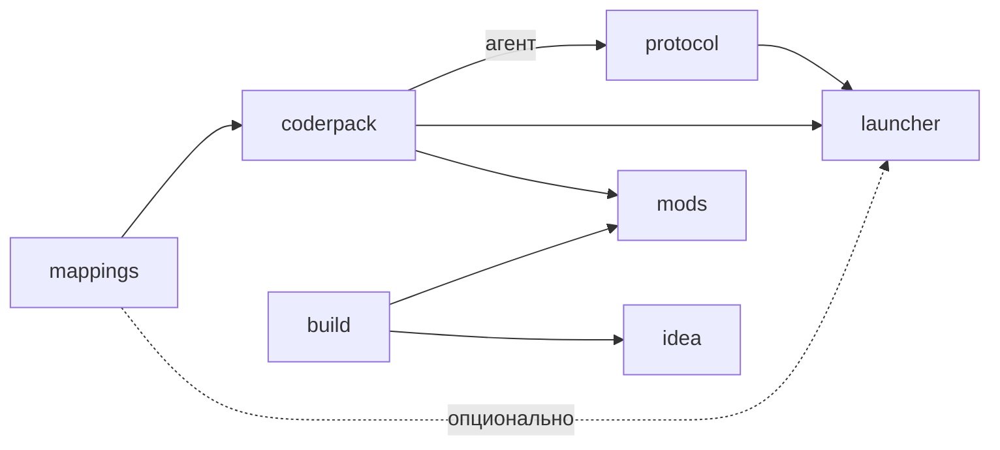

[English](CONTRIBUTING.EN.md) · [Deutsch](CONTRIBUTING.DE.md)

# Участие в разработке

Здесь собрано всё, что нужно для работы над самим загрузчиком: как получить
исходники, как репозитории зависят друг от друга, как их собрать и выпустить.
Если вы пишете мод, этот файл вам не нужен: начните с [README](README.md).

## Исходники

Каждый репозиторий собирается сам по себе. Для правки одного компонента
клонируйте только его:

```
git clone https://github.com/ancaria-dev/coderpack.git
```

Недостающие соседи сборка скачивает сама. `coderpack` берёт `mappings.json` на
ревизии из `.mappings-ref`. `protocol`, `launcher` и `mods` держат в корне
`dependencies.json` с точными версиями чужих GitHub-релизов. Версия «latest»
не используется: неудачный релиз соседа не сломает вашу сборку без
предупреждения. `mods` получает плагин и API из Gradle Plugin Portal и Maven
Central, `idea` — шаблоны `coderpack` из Maven Central.

Если изменение затрагивает несколько репозиториев, соберите их рядом.
Клонируйте этот репозиторий, а остальные положите внутрь под их собственными
именами. Сборки находят соседей именно по этим именам, и соседний чекаут
всегда важнее пина:

```
git clone https://github.com/ancaria-dev/.github.git ancaria
cd ancaria
for repo in mappings research coderpack protocol launcher build mods idea site; do
    git clone https://github.com/ancaria-dev/$repo.git
done
```

`ancaria.code-workspace` открывает все папки в одном окне VS Code.

## Зависимости между репозиториями



Пунктир — необязательная зависимость. Циклов в графе нет. `build` не зависит
от `coderpack`: линтер и шаблоны используют собственную заглушку API. CI
`coderpack` читает исходники `build` и `launcher`, чтобы сверить номер
API-контракта, но это проверка, а не зависимость. `research` и `site` в граф не
входят.

## Сборка

| Репозиторий | Команда | Результат |
|---|---|---|
| `mappings` | `python mappings.generator.py` | `mappings.json` с адресами для агента |
| `coderpack` | `gradlew build` | `api`, `api-kotlin` и `zygote` в виде jar. CI отдельно упаковывает агент в `agent.zip` |
| `protocol` | `cargo build --release` | `target/release/protocol.exe` — хост со встроенным агентом |
| `build` | `./gradlew build` в папке `gradle` | Gradle-плагин, линтер и архив с утилитой `coderpack` |
| `launcher` | `pwsh tools/build.ps1` | `dist/Sacred Mod Loader.exe` со встроенными хостом и jar-файлами |
| `mods` | `gradlew assembleSacredMod` | Четыре мода, проверенные линтером. Индекс реестра обновляет `coderpack index` |
| `idea` | `./gradlew buildPlugin` | Zip плагина в `build/distributions/` |
| `site` | `pnpm build` | Папка `dist/`. CI выкладывает её в Cloudflare с `master` |

У `research` общей сборки нет: там лежат отдельные скрипты под конкретные
исследования. Все адреса хуков берутся из `mappings`, а как их нашли,
записано в `research`.

## Версии

Номер версии повторяется в нескольких местах: в `gradle.properties`,
`Cargo.toml`, README, иногда в комментарии. Пропустите одно — и релиз разойдётся
с документацией.

Поэтому в каждом репозитории с версией есть `tools/version.ps1`. Без аргумента
он печатает текущую версию, с аргументом переписывает её везде сразу:

```
pwsh tools/version.ps1
pwsh tools/version.ps1 0.200.1
```

Скрипт меняет только собственную версию репозитория. Пины чужих релизов в
`dependencies.json` и каталоге версий Gradle поднимайте отдельным коммитом.

> [!NOTE]
> В `mods` у каждого мода своя версия. `mods/tools/version.ps1` поднимает все
> четыре сразу, но только если они уже совпадают. Иначе скрипт покажет все
> версии и остановится. Записи `plugin` и `api` в `gradle/libs.versions.toml`
> он не трогает: это версии инструментов, а не модов.

## Релизы

CI выпускает релиз, когда тега `v<версия>` ещё нет, и затем создаёт этот тег.
Чтобы выпустить релиз, поднимите версию. Моды выходят по одному с тегами
`<id>-v<версия>`.

Изменение доходит до игрока только через релизы зависимых репозиториев. Что
поднять дальше:

| Что изменилось | Что сделать дальше |
|---|---|
| `mappings` | Своих релизов нет. `coderpack` генерирует `addr.js` заново и выпускает релиз, дальше как для агента |
| Агент в `coderpack` | Релиз `coderpack`, пин в `protocol/dependencies.json` и релиз `protocol`, затем оба пина в `launcher/dependencies.json` и релиз `launcher` |
| `zygote` | Релиз `coderpack`, пин в `launcher/dependencies.json` и релиз `launcher` |
| `api` или `api-kotlin` | Релиз `coderpack` и Publish в Central. Затем `apiVersion` в шаблонах `build`, `api` в `mods/gradle/libs.versions.toml` и пин в `launcher/dependencies.json` |
| Номер API-контракта | Одна правка в трёх местах: `Api.VERSION` в `coderpack`, `Verifier.API` в `build`, `mods.API` в `launcher`. CI `coderpack` падает, пока `build` и `launcher` не запушены, но публикацию не блокирует |
| `protocol` | Пин в `launcher/dependencies.json` и релиз `launcher` |
| `build` | Релиз `build` и Publish в Central. Затем `plugin` в `mods/gradle/libs.versions.toml`, пин утилиты в `mods/dependencies.json` и `coderpack` в `idea/gradle/libs.versions.toml` |
| `launcher`, `idea`, мод | Ничего: от них никто не зависит |
| `site` | Релизов нет. Примеры на сайте обновляйте после всех релизов |

Если изменение проходит всю цепочку, выпускайте в таком порядке:

1. `mappings`
2. `coderpack`, затем Publish в Central
3. `build`, когда новый `api` уже доступен в Central, затем снова Publish
4. `protocol` с новым пином `coderpack`
5. `launcher` с новыми пинами `protocol` и `coderpack`
6. `mods`, после Publish из шагов 2 и 3
7. `idea`, когда Central отдаёт POM новых `templates`
8. `site`

Загрузка в Central — ещё не релиз. Артефакт становится доступен, только когда
в портале нажата кнопка Publish. Прежде чем поднимать пин на Maven-артефакт,
запросите его POM.
