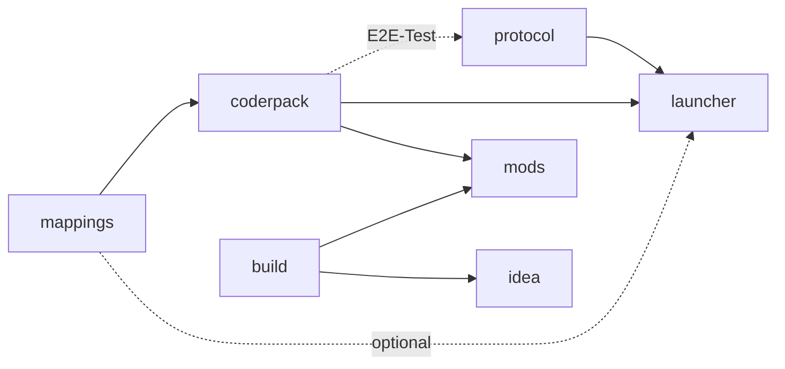

<div align="center">


</div>

[Русский](README.md) · [English](README.EN.md)

# ancaria

Sacred erschien 2004 für Windows, die Zusammenstellung Sacred Gold folgte 2005.
Ancaria rüstet eine Mod-Schnittstelle für dieses 32-Bit-Spiel nach. Mods werden
in Java gegen eine Event-API geschrieben. Die Dateien der Spielinstallation
bleiben unangetastet, denn sämtliche Hooks liegen nur im Arbeitsspeicher und
verschwinden mit dem Spielprozess.

Hinter dem Projekt steckt eine Frage, die nach einem Lieblingsspiel aus
Kindertagen nicht mehr wegging: Lässt sich mehr als zwanzig Jahre später ein
Mod-Loader nach dem Vorbild von Forge an eine 32-Bit-Windows-Binärdatei
anbauen? Ja. Die eingesetzte 64-Bit-JVM lässt sich allerdings nicht in den
32-Bit-Prozess des Spiels laden. Deshalb arbeiten hier drei Teile zusammen.
Ein Rust-Host injiziert einen JavaScript-Agenten in das Spiel, startet eine JVM
daneben und vermittelt ein zeilenbasiertes Protokoll zwischen beiden. Der Agent
setzt Hooks an den Instruktionen des Spiels. Auf der JVM-Seite werden die daraus
entstehenden Ereignisse an die Mods verteilt. Darf ein Mod ein Ereignis
abbrechen oder verändern, wartet der Spiel-Thread auf dessen Antwort. Nach
250 ms sendet der Host `ok`, falls der Mod nicht rechtzeitig geantwortet hat.

Ancaria ist weder ein Mehrspieler-Cheat noch ein Crack oder eine Bezugsquelle
für das Spiel. Ohne eine eigene, installierte Ausgabe von Sacred Gold
funktioniert nichts davon.

Dieses Repository enthält keinen Programmcode. Es ist die gemeinsame
Arbeitskopie, in der alle neun Projekt-Repositories als Git-Submodule
eingebunden sind. Die Startseite [ancaria.dev](https://ancaria.dev) entsteht
aus `site`.

## Die neun Repositories

| Repository | Was drin ist |
|---|---|
| [`mappings`](https://github.com/ancaria-dev/mappings) | Das Adressregister für `pureHD.exe` 2.0.2.118. Zu jeder bestätigten Adresse gehören VA, RVA und eine Angabe zur Verlässlichkeit. |
| [`research`](https://github.com/ancaria-dev/research) | Skripte zur Disassemblierung, Laufzeitanalysen und die dabei entstandenen Notizen. Nichts daraus wird an Spieler ausgeliefert. |
| [`coderpack`](https://github.com/ancaria-dev/coderpack) | Der Frida-Agent, die Java-API für Mods und der JVM-seitige Loader, der Ereignisse an die Mods verteilt. |
| [`protocol`](https://github.com/ancaria-dev/protocol) | Das Sacred Communication Protocol und der Rust-Host, der Nachrichten zwischen Spiel und JVM überträgt. |
| [`launcher`](https://github.com/ancaria-dev/launcher) | Die einzelne EXE-Datei für den Spielordner. Im Launcher werden Mods ausgewählt und das Spiel gestartet. |
| [`build`](https://github.com/ancaria-dev/build) | Build-Unterstützung für Mod-Autoren. Derzeit gibt es ein Gradle-Plugin. Für Maven liegt ein Entwurf vor. |
| [`mods`](https://github.com/ancaria-dev/mods) | Das offizielle Mod-Repository mit vier Mods und dem Index, den der Launcher standardmäßig liest. |
| [`idea`](https://github.com/ancaria-dev/idea) | Das Plugin "Sacred Mod Development" für IntelliJ IDEA mit Projektassistent, Run-Konfiguration, Randsymbolen und Einstellungsseite. Das Repository existiert, ist aber noch leer. |
| [`site`](https://github.com/ancaria-dev/site) | Der Quelltext von [ancaria.dev](https://ancaria.dev): eine React- und Vite-Oberfläche ohne Backend. Die CI baut sie und veröffentlicht sie bei Cloudflare. |

### Wie die Repositories voneinander abhängen



Der Graph ist zyklenfrei. Eine gestrichelte Kante ist optional oder nur für
Tests. `build` hängt bewusst nicht von `coderpack` ab: Linter und Vorlagen
nutzen einen eigenen API-Stub statt einer echten Maven-Abhängigkeit, wodurch
der Graph zyklenfrei bleibt, obwohl die CI von `coderpack` `build` und
`launcher` auscheckt, um eine API-Contract-Konstante mit deren Quellcode
abzugleichen -- das ist ein Lesezugriff für eine Prüfung, keine
Veröffentlichungsabhängigkeit. `research` steht nicht im Graphen: nichts
hängt davon ab, und es veröffentlicht selbst nichts.

## Für Spieler

1. `Sacred Mod Loader.exe` aus den
   [Releases](https://github.com/ancaria-dev/launcher/releases) laden.
2. Die Datei in den Sacred-Gold-Ordner legen, in dem auch die EXE-Datei des
   Spiels liegt.
3. Den Launcher öffnen, im Reiter Available die gewünschten Mods installieren
   und Play drücken.

Die Mods benötigen ein JDK ab Version 21. Der Launcher sucht zuerst nach einer
bereits heruntergeladenen Kopie in `launcher\java`, danach unter `JAVA_HOME` und
zuletzt im `PATH`. Findet er kein geeignetes JDK, bleibt Sacred Gold trotzdem
startfähig, aber die Mods werden nicht geladen. Über Get Java lässt sich ein JDK
auswählen und in `launcher\java` herunterladen. Außerhalb des Spielordners wird
dabei nichts installiert oder verändert.

Beim ersten Start legt der Launcher im Spielordner die Verzeichnisse `launcher`
und `mods` an. Verfügbare Mods liest er standardmäßig aus dem
[offiziellen Repository](https://github.com/ancaria-dev/mods) und installiert
die ausgewählten JAR-Dateien selbst. Weitere Repositories werden per
Klon-URL hinzugefügt. Private Repositories funktionieren mit einem passenden
Token.

## Für Entwickler

### Einen Mod schreiben

Das Kommandozeilenwerkzeug `coderpack` liegt jedem
[Release von `build`](https://github.com/ancaria-dev/build/releases) als
ZIP-Datei bei. Nach dem Entpacken wird dessen Verzeichnis `bin` in den `PATH`
aufgenommen. Danach genügt:

```
coderpack new my-mod
```

In `my-mod/` entsteht ein vollständiges Projekt mit Gradle Wrapper,
ausgefülltem `sacred { }`-Block und einem funktionierenden Listener. Der Befehl
`gradlew assembleSacredMod` baut daraus die JAR-Datei für den Loader. Paket,
Anzeigename, Autor und weitere Angaben lassen sich über Optionen festlegen.
`coderpack help` zeigt die verfügbaren Parameter. Bis zum ersten Release wird
das Werkzeug aus einem Checkout von `build` im Verzeichnis `gradle` mit
`./gradlew :templates:installDist` erzeugt.

Ein Mod-Projekt lässt sich ebenso von Hand anlegen. Für ein gewöhnliches
Gradle-Projekt in IntelliJ IDEA reichen drei Dateien.

In `settings.gradle.kts` stehen die Quellen für Plugin und API:

```kotlin
pluginManagement {
    repositories {
        mavenLocal()
        gradlePluginPortal()
    }
}

dependencyResolutionManagement {
    repositories {
        mavenLocal()
        mavenCentral()
    }
}

rootProject.name = "double-gold"
```

`build.gradle.kts` beschreibt den Mod. Verlangt werden nur `id` und
`entrypoint`. Mit `apiVersion` wird
`dev.ancaria.coderpack:api` in der Konfiguration `compileOnly` eingebunden:

```kotlin
plugins {
    id("dev.ancaria.coderpack") version "0.99.0"
}

version = "1.0.0"

sacred {
    id = "double-gold"
    displayName = "Double Gold"
    entrypoint = "demo.DoubleGold"
    apiVersion = "0.99.0"
    author("you")
}
```

Der eigentliche Mod liegt in `src/main/java/demo/DoubleGold.java`:

```java
package demo;

import dev.ancaria.coderpack.api.Context;
import dev.ancaria.coderpack.api.SacredMod;
import dev.ancaria.coderpack.api.event.Gold;

public final class DoubleGold implements SacredMod {

    @Override
    public void onLoad(Context context) {
        context.events().on(Gold.class, e -> {
            if (!e.spending()) e.delta(e.delta() * 2);
        });
    }
}
```

Nach `gradlew assembleSacredMod` wird aufgesammeltes Gold verdoppelt. Die
Methode `on` registriert den Listener als Lambda und liefert ein `Handle`
zurück, über das er später wieder abgemeldet werden kann. Alternativ markiert
`@Subscribe` eine öffentliche Methode mit genau einem Ereignisparameter. Die
Annotation unterstützt außerdem `priority` und `ignoreCancelled`. Das
`Gold`-Ereignis wird ausgelöst, bevor das Spiel den Wert schreibt. Deshalb kann
der Mod das Delta noch ändern. Weitere Ereignistypen liegen im Paket
`dev.ancaria.coderpack.api.event`.

### Bauen

Jedes Repository lässt sich einzeln bauen. `coderpack` lädt `mappings.json` in
der Revision, die in `.mappings-ref` steht. Für GitHub-Releases eines anderen
Repositories -- keine Maven-Koordinate, die ein Build-Tool ohnehin versioniert
-- pflegen `launcher` und `mods` je eine `dependencies.json` mit einer exakt
gepinnten Version, nie "latest": ein schlechtes Release woanders soll den
eigenen Build nicht unangekündigt brechen können, und ein benachbarter
Checkout gewinnt trotzdem immer gegen den Pin. `mods` und `idea` beziehen
Plugin und API über das Gradle Plugin Portal und Maven Central. Es genügt
daher, das Repository zu klonen, an dem gearbeitet werden soll:

```
git clone https://github.com/ancaria-dev/coderpack.git
```

Die gesamte Arbeitskopie lässt sich ebenfalls klonen:

```
git clone --recurse-submodules https://github.com/ancaria-dev/.github.git
```

`ancaria.code-workspace` öffnet das Hauptverzeichnis und alle neun vorhandenen
Projektordner gemeinsam in VS Code. Ein rekursiver Klon holt alle neun
Submodule; `idea` kommt dabei als leeres Verzeichnis an, solange dort noch
nichts gepusht wurde. Für die einzelnen Builds ist die gemeinsame Arbeitskopie
nicht erforderlich.

Was dabei jeweils herauskommt:

| Repository | Womit gebaut | Was herauskommt |
|---|---|---|
| `mappings` | `python mappings.generator.py` | `mappings.json`, aus der die übrigen Komponenten ihre Adressen beziehen |
| `coderpack` | `gradlew build` | `api-0.99.0.jar` für Mod-Builds und `zygote-0.99.0.jar` für die JVM-Seite. Die CI packt den erzeugten Agenten zusätzlich als Release-Datei `agent.zip` |
| `protocol` | `cargo build --release` | `target/release/protocol.exe`, der Host zwischen Spiel und JVM, mit dem minifizierten Agenten darin |
| `build` | `./gradlew build` im Verzeichnis `gradle` | das Gradle-Plugin, der Linter und `coderpack-0.99.0.zip` mit dem Kommandozeilenwerkzeug |
| `launcher` | `pwsh tools/build.ps1` | `dist/Sacred Mod Loader.exe` mit eingebettetem Host und JAR-Dateien |
| `mods` | `gradlew assembleSacredMod` | vier vom Linter geprüfte JAR-Dateien. `coderpack index` aktualisiert `sacred.mods.repository.json` separat |
| `idea` | `./gradlew buildPlugin` | `build/distributions/sacred-idea-0.99.0.zip`. Bei einem Release lädt die CI das Plugin auch zum JetBrains Marketplace hoch |
| `site` | `pnpm build` | das Verzeichnis `dist/`. Auf `master` veröffentlicht die CI es bei Cloudflare; ein Release gibt es hier nicht |

`research` erzeugt kein auslieferbares Artefakt. Dort liegen die Skripte und
Notizen, mit denen einzelne Fragen zum Spiel untersucht wurden.

Jede Adresse, an der der Agent einen Hook setzt, stammt aus einer Zeile in
`mappings`. Die dazugehörige Recherche ist in `research` dokumentiert.

Releases sind an Versionsnummern gebunden. Jedes veröffentlichende Repository
verwaltet seine eigene Version. Die jeweilige CI veröffentlicht nur, wenn das
Tag `v<Version>` noch nicht existiert, und legt dieses Tag anschließend an.
Eine neue Versionsnummer löst damit den nächsten Release aus. Mods werden
einzeln unter Tags der Form `<id>-v<Version>` veröffentlicht.

### Versionen aktualisieren

Die Versionsnummer steht nicht an einer Stelle. Sie verteilt sich auf
`gradle.properties`, `Cargo.toml`, ein README, manchmal sogar auf einen
Kommentar mitten im Code. Vergisst man eine davon, driftet der gebaute
Release still von dem ab, was in der Doku steht.

Jedes Repository mit einer Version hat auch `tools/version.ps1`. Ohne Argument
gibt es die aktuelle Nummer aus. Mit einer neuen Nummer schreibt es sie an
jeder Stelle in diesem Repository in einem Durchgang neu:

```
pwsh tools/version.ps1
pwsh tools/version.ps1 0.99.1
```

## Zum Schluss

Ancaria begann als Proof of Concept. Verbindlichen Support gibt es nicht. Das
Projekt beantwortet zunächst eine sehr konkrete Frage: Kann ein Java-Mod in
einem alten Lieblingsspiel funktionieren?

## Referenzen

Ein Teil der Ergebnisse in `research` und `mappings` baut auf früherer
Community-Arbeit auf: Reverse Engineering der Datenformate und Strukturen des
Spiels in [SacredGameTools](https://github.com/sonicmouse/SacredGameTools) und
[sacred-sdk](https://github.com/bssth/sacred-sdk). Die Modifikation
[pureHD](https://steamcommunity.com/app/12320/discussions/0/3191364450206457546/)
ist die Basis für die Mods hier – jede Adresse in `mappings` zielt auf genau
diesen `pureHD.exe`-Build.

Danke an die Community, die dieses Spiel von 2004 immer noch auseinandernimmt,
obwohl die moderne Spieleindustrie solchen Spielen längst den Tod vorherbestimmt
hat. Ich habe seitdem Path of Exile, Path of Exile 2, Last Epoch und Titan
Quest gespielt – keines davon ist es: nicht die Atmosphäre, nicht der Vibe,
nicht die unbeschwerte, lässige und zugleich durchdachte Machart, die Sacred
hatte. Solche Spiele wird es nie wieder geben, aber im Herzen bleibt es
trotzdem.

## Lizenz

MIT, siehe [LICENSE](LICENSE).
