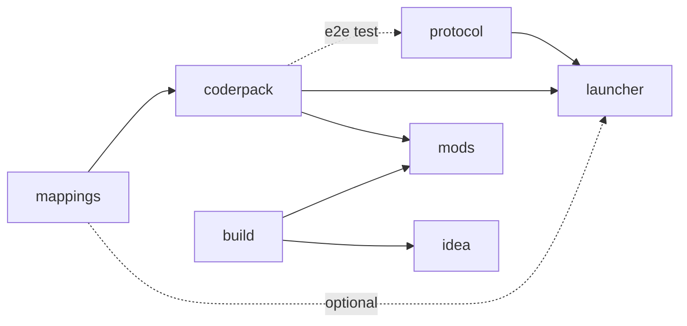

<div align="center">


</div>

[Русский](README.md) · [Deutsch](README.DE.md)

# ancaria

Sacred was released for Windows in 2004, followed by the Sacred Gold compilation
in 2005. ancaria adds a mod loader to that 32-bit game. Mods are written in Java or Kotlin
against an event API. The loader does not patch files in the game folder. Its
hooks exist only in the running process and disappear when the game closes.

A 32-bit process cannot host the 64-bit JVM used by the loader, so the system
has three parts. A Rust host injects a JavaScript agent into the game and starts
the JVM in a separate process. The agent hooks the game's instructions, the
host carries line-based protocol messages between the agent and the JVM, and
the JVM dispatches events to mods. A vetoable event blocks the game thread
while it waits for a reply. After 250 ms, the host answers `ok` for a slow mod.

The project is for single-player use. It does not bypass DRM, provide the game,
or redistribute game files. You need your own installed copy of Sacred Gold.

This repository contains no application code. It is the workspace that joins
the other repositories, all nine of them Git submodules. The front page at
[ancaria.dev](https://ancaria.dev) is built from `site`.

## The nine repositories

| Repository | What it holds |
|---|---|
| [`mappings`](https://github.com/ancaria-dev/mappings) | The address registry for `pureHD.exe` 2.0.2.118. Each row records a virtual address, a relative virtual address, and its confidence level. |
| [`research`](https://github.com/ancaria-dev/research) | Disassembly scripts, live probes, and research notes. None of it ships to players. |
| [`coderpack`](https://github.com/ancaria-dev/coderpack) | The Frida agent, the Java API used by mods, its Kotlin extensions, the JVM-side loader, and the tools that generate the agent's address table. |
| [`protocol`](https://github.com/ancaria-dev/protocol) | The wire protocol and the Rust host that connects the game process to the JVM. |
| [`launcher`](https://github.com/ancaria-dev/launcher) | The Windows executable that installs the loader, manages mods, and starts the game. |
| [`build`](https://github.com/ancaria-dev/build) | The Gradle plugin, mod linter, and `coderpack` project scaffolder. The Maven directory currently contains design notes only. |
| [`mods`](https://github.com/ancaria-dev/mods) | The default SRML mod repository and the source for four mods. |
| [`idea`](https://github.com/ancaria-dev/idea) | The IntelliJ IDEA plugin, with a New Project wizard, a Run Sacred configuration, gutter icons, and loader settings. The repository exists but is still empty. |
| [`site`](https://github.com/ancaria-dev/site) | The source of [ancaria.dev](https://ancaria.dev): a React and Vite front end with no backend. CI builds it and ships it to Cloudflare. |

### How the repositories depend on each other



No cycles. A dashed edge is optional or test-only. `build` deliberately does
not depend on `coderpack`: the linter and the templates use their own API stub
instead of a real Maven dependency, which keeps this graph acyclic even though
`coderpack`'s CI checks out `build` and `launcher` to compare an API-contract
constant against their source: that is a source read for a check, not a
publish-time dependency. `research` is not in the graph: nothing depends on
it and it publishes nothing.

## For players

1. Download `Sacred Mod Loader.exe` from the
   [releases](https://github.com/ancaria-dev/launcher/releases).
2. Put the file in your Sacred Gold folder, beside the game's own executable.
3. Run it, install the mods you want from the Available tab, then press Play.

The first run creates `launcher` and `mods` beside the game executable. The
launcher looks for a JDK 21 or newer in `launcher\java`, `JAVA_HOME`, and PATH,
in that order. If it cannot find one, the game can still start, but mods do not
load. The "Get Java" panel downloads a chosen JDK to `launcher\java`. The
launcher does not change PATH, write a registry key, or install Java elsewhere.

The Available tab reads the default
[mod repository](https://github.com/ancaria-dev/mods) and installs the mods you
select. You can add another SRML repository by its HTTPS clone URL. Private
repositories are supported when you provide a token.

## For developers

### Writing a mod

Each [build](https://github.com/ancaria-dev/build/releases) release includes the
`coderpack` command-line distribution. Unpack it, add its `bin` directory to
PATH, and create a project with:

```
coderpack new my-mod
```

The generated `my-mod/` project includes a Gradle wrapper, a configured
`sacred { }` block, and one event listener. Run
`gradlew assembleSacredMod` to build the jar under `build/sacred-mod`.
`coderpack help` lists options for the package, display name, author, language,
build DSL, and other project settings.

Until the first release, build the command line from a local `build` checkout.
Run `./gradlew :templates:installDist` from its `gradle` directory.

You can also create the Java project yourself. It needs three files.

Use this `settings.gradle.kts` to resolve the plugin and API:

```kotlin
pluginManagement {
    repositories {
        mavenLocal()
        gradlePluginPortal()
    }
}

dependencyResolutionManagement {
    repositories {
        mavenLocal()
        mavenCentral()
    }
}

rootProject.name = "double-gold"
```

The `build.gradle.kts` file describes the mod. Only `id` and `entrypoint` are
required. Setting `apiVersion` adds `dev.ancaria.coderpack:api` as a
`compileOnly` dependency:

```kotlin
plugins {
    id("dev.ancaria.coderpack") version "0.100.2"
}

version = "1.0.0"

sacred {
    id = "double-gold"
    displayName = "Double Gold"
    entrypoint = "demo.DoubleGold"
    apiVersion = "0.100.0"
    author("you")
}
```

Add the mod class at `src/main/java/demo/DoubleGold.java`:

```java
package demo;

import dev.ancaria.coderpack.api.Context;
import dev.ancaria.coderpack.api.SacredMod;
import dev.ancaria.coderpack.api.event.Gold;

public final class DoubleGold implements SacredMod {

    @Override
    public void onLoad(Context context) {
        context.events().on(Gold.class, e -> {
            if (!e.spending()) e.delta(e.delta() * 2);
        });
    }
}
```

Run `gradlew assembleSacredMod`. The resulting mod doubles positive gold
changes and leaves spending unchanged. `on` registers a lambda listener and
returns a `Handle` that can unregister it. You can instead annotate a public
one-parameter method with `@Subscribe`, which also supports `priority` and
`ignoreCancelled`.

The `Gold` event arrives before the game applies the change, so replacing its
delta changes the amount the game writes. Other event classes are in
`dev.ancaria.coderpack.api.event`.

A Kotlin mod can say the same thing through
`dev.ancaria.coderpack:api-kotlin`, which every project from
`coderpack new --language kotlin` already depends on. The event becomes a type
argument and a rewritable field becomes a `var`, so the listener above is
`on<Gold> { if (!it.spending) it.delta *= 2 }`. It forwards to the Java API and
adds nothing to it, so a Kotlin mod that ignores it works the same way.

### Building it

The repositories are designed to build independently. `coderpack` downloads
`mappings.json` at the revision in `.mappings-ref` when no local registry is
available. For GitHub releases of another repository (not a Maven
coordinate, which a build tool already versions) `launcher` and `mods` each
keep a `dependencies.json` pinning an exact version, never "latest", so a bad
release elsewhere cannot break the build unannounced. A sibling checkout still
wins over the pin when one is present. `mods` and `idea` resolve the Gradle
plugin and Java API from the Gradle Plugin Portal and Maven Central.

Clone only the repository you want to change:

```
git clone https://github.com/ancaria-dev/coderpack.git
```

For a side-by-side checkout, clone this repository with its nine submodules:

```
git clone --recurse-submodules https://github.com/ancaria-dev/.github.git
```

The `ancaria.code-workspace` file opens the root and all nine project
directories in one VS Code window when they are present. A recursive clone gets
all nine, though `idea` arrives as an empty directory until that project has
been pushed for the first time.

What each one produces:

| Repository | Built with | What comes out |
|---|---|---|
| `mappings` | `python mappings.generator.py` | `mappings.json`, the address registry consumed by the agent build |
| `coderpack` | `gradlew build` | `api-0.100.0.jar`, `api-kotlin-0.100.0.jar`, and `zygote-0.100.0.jar`. CI also packs the generated agent as the `agent.zip` release asset |
| `protocol` | `cargo build --release` | `target/release/protocol.exe`, the Rust host, with the agent minified inside it |
| `build` | `./gradlew build` in `gradle` | The Gradle plugin, linter, scaffolder, and `coderpack-0.100.2.zip` distribution |
| `launcher` | `pwsh tools/build.ps1` | `dist/Sacred Mod Loader.exe` with the host and jars embedded |
| `mods` | `gradlew assembleSacredMod` | Four linted mod jars. Run `coderpack index` separately to regenerate `sacred.mods.repository.json` |
| `idea` | `./gradlew buildPlugin` | `build/distributions/sacred-idea-0.100.2.zip`. On release, CI also uploads the plugin to the JetBrains Marketplace |
| `site` | `pnpm build` | A `dist/` directory. On `master`, CI deploys it to Cloudflare, and this repository publishes no release |

`research` has no build output. It records the scripts, probes, and notes used
to identify game behavior. Every hook address comes from `mappings`, whose rows
target `pureHD.exe` 2.0.2.118.

Each publishing repository stores its own version. CI publishes only when the
matching `v<version>` tag does not exist, then creates that tag. Releasing a new
version therefore requires changing the repository's version first. Mod
releases are published one at a time under tags of the form `<id>-v<version>`.

### Updating versions

The version number does not live in one file. It is scattered across
`gradle.properties`, `Cargo.toml`, a README, sometimes a comment sitting in
plain view in the code. Miss one of those spots and the built release quietly
drifts from what the docs say.

Every repository that has a version also has `tools/version.ps1`. Run it with
no argument and it prints the current one. Give it a new one and it rewrites
every spot in that repository in one pass:

```
pwsh tools/version.ps1
pwsh tools/version.ps1 0.99.1
```

The project began as a proof of concept and does not promise support.

## References

Some of the findings in `research` and `mappings` build on earlier community
work: reverse-engineering of the game's formats and structures in
[SacredGameTools](https://github.com/sonicmouse/SacredGameTools) and
[sacred-sdk](https://github.com/bssth/sacred-sdk). The
[pureHD](https://steamcommunity.com/app/12320/discussions/0/3191364450206457546/)
modification is the base for the mods here — every address in `mappings`
targets that exact `pureHD.exe` build.

Thanks to the community that still keeps taking this 2004 game apart, even
though the modern games industry long ago wrote it off. I've played Path of
Exile, Path of Exile 2, Last Epoch, and Titan Quest since — none of
them are it: not the atmosphere, not the vibe, not the same carefree, casual,
and well-crafted game Sacred was. Games like it will never be made again, but
it stays in the heart regardless.

## License

MIT, see [LICENSE](LICENSE).
