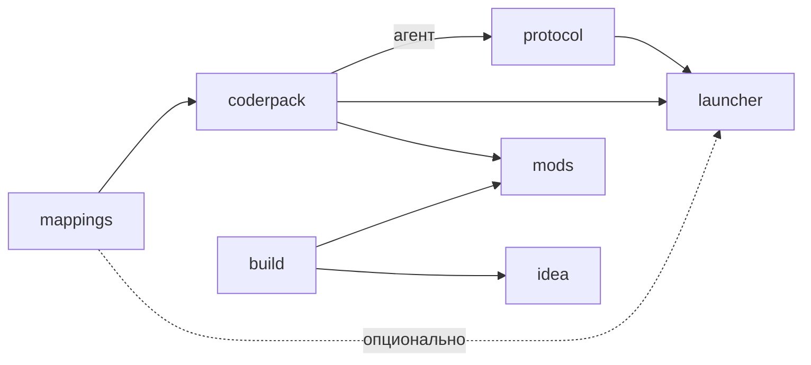

<div align="center">


</div>

[English](README.EN.md) · [Deutsch](README.DE.md)

# ancaria

Sacred вышла в 2004 году без инструментов для модификации, а сборник Sacred Gold
появился в 2005-м. Теперь моды можно писать на Java или Kotlin через API событий.
Файлы игры на диске при этом не меняются: хуки существуют только в памяти и
исчезают после завершения процесса.

Проект начался с вопроса, который не отпускал меня с детства: можно ли спустя
двадцать лет сделать для 32-битной Windows-игры загрузчик модов в духе Forge?
Можно, но 64-битная JVM не загружается в 32-битный процесс. Поэтому загрузчик
работает в трёх частях. Rust-хост внедряет в игру JavaScript-агент, запускает
рядом JVM и передаёт между ними сообщения строчного протокола. Агент ставит
хуки на инструкции игры, а JVM передаёт события модам. Если событие можно
отменить, игровой поток ждёт ответа мода. Если мод не успел ответить, хост
отправляет `ok` от его имени, обычно через 250–375 мс после запроса, поэтому
такие обработчики должны быть короткими.

Проект предназначен только для одиночной игры. Здесь нет самой Sacred Gold,
средств обхода DRM и функций для мультиплеера. Нужна собственная установленная
копия игры.

В этом репозитории нет кода. Он объединяет группу репозиториев проекта в одну
рабочую копию. Сама страница [ancaria.dev](https://ancaria.dev) собирается из
репозитория `site`.

## Компоненты проекта

| Репозиторий | Что внутри |
|---|---|
| [`mappings`](https://github.com/ancaria-dev/mappings) | Реестр адресов для `pureHD.exe` 2.0.2.118: VA, RVA и уровень достоверности каждой записи. |
| [`research`](https://github.com/ancaria-dev/research) | Скрипты дизассемблирования, пробы и заметки о том, как находились адреса и поведение игры. Эти материалы не входят в сборку для игроков. |
| [`coderpack`](https://github.com/ancaria-dev/coderpack) | Frida-агент, Java API для компиляции модов, его Kotlin-расширения и загрузчик на стороне JVM, который принимает события и передаёт их модам. |
| [`protocol`](https://github.com/ancaria-dev/protocol) | Sacred Communication Protocol и Rust-хост, который передаёт сообщения между игрой и JVM. |
| [`launcher`](https://github.com/ancaria-dev/launcher) | Один исполняемый файл для папки с игрой. В нём можно выбрать моды и запустить Sacred Gold. |
| [`build`](https://github.com/ancaria-dev/build) | Инструменты сборки для авторов модов. Сейчас это Gradle-плагин. Поддержка Maven появится при необходимости. |
| [`mods`](https://github.com/ancaria-dev/mods) | Официальный реестр модов и четыре мода. Лаунчер подключает этот реестр по умолчанию. |
| [`idea`](https://github.com/ancaria-dev/idea) | Плагин для IntelliJ IDEA с мастером нового проекта, конфигурацией запуска Sacred, значками на полях и настройкой папки игры. |
| [`site`](https://github.com/ancaria-dev/site) | Исходники [ancaria.dev](https://ancaria.dev): React и Vite, без бэкенда. CI собирает страницу и выкладывает её в Cloudflare. |

### Зависимости между репозиториями



Граф без циклов. Пунктир — необязательная или тестовая зависимость. `build`
намеренно не зависит от `coderpack`: линтер и шаблоны используют собственную
заглушку API вместо реальной Maven-зависимости, поэтому граф остаётся
ациклическим даже с учётом того, что CI `coderpack` сверяет номер API-контракта
с исходниками `build` и `launcher` — это чтение исходников для проверки, а не
зависимость публикации. `research` и `site` в граф не входят: от них никто не
зависит, и сами они ни от кого не зависят.

## Игроку

1. Скачайте `Sacred Mod Loader.exe` из
   [релизов](https://github.com/ancaria-dev/launcher/releases).
2. Положите файл в папку Sacred Gold, туда же, где лежит экзешник игры.
3. Запустите, поставьте моды из вкладки Available, нажмите Play.

Устанавливать Java заранее не нужно. Лаунчер ищет JDK 21 или новее сначала в
`launcher\java`, затем в `JAVA_HOME` и в конце в PATH. Если подходящей версии
нет, игра всё равно запускается, но моды не загружаются. Через окно Get Java
можно выбрать JDK и скачать его в `launcher\java` внутри папки игры. PATH,
реестр Windows и каталоги за пределами папки игры не меняются. При первом
запуске рядом с игрой также появляются папки `launcher` и `mods`.

Лаунчер показывает содержимое
[реестра](https://github.com/ancaria-dev/mods) и устанавливает выбранные моды в
папку игры. Другой реестр можно добавить по ссылке для клонирования. Для
приватного репозитория понадобится токен.

## Разработчику

### Свой мод

Проще всего начать в IntelliJ IDEA. Плагин
[Sacred Mod Development](https://plugins.jetbrains.com/plugin/34165-sacred-mod-development) из JetBrains
Marketplace добавляет мастер File → New → Project → Sacred Mod, конфигурацию
Run Sacred, которая собирает мод и запускает с ним игру, и значки на полях у
точки входа и слушателей.

Без IDE тот же проект создаёт командная утилита `coderpack`. Она входит в
zip-архив каждого релиза
[build](https://github.com/ancaria-dev/build/releases). Распакуйте архив,
добавьте `bin` в PATH и выполните:

```
coderpack new my-mod
```

В `my-mod/` появится проект с Gradle Wrapper, заполненным блоком `sacred { }` и
готовым слушателем. Команда `gradlew assembleSacredMod` собирает jar для
загрузчика. Пакет, отображаемое имя, автора и другие параметры задают ключами,
перечисленными в `coderpack help`. Чтобы попробовать неопубликованные
изменения, соберите утилиту из чекаута `build`: запустите
`./gradlew :templates:installDist` в каталоге `gradle`.

Проект можно создать вручную. Для обычного Gradle-проекта в IntelliJ IDEA
достаточно трёх файлов.

`settings.gradle.kts` задаёт репозитории для плагина и API:

```kotlin
pluginManagement {
    repositories {
        mavenLocal()
        gradlePluginPortal()
    }
}

dependencyResolutionManagement {
    repositories {
        mavenLocal()
        mavenCentral()
    }
}

rootProject.name = "double-gold"
```

`build.gradle.kts` описывает мод. Плагину обязательны `id` и `entrypoint`.
Параметр `apiVersion` добавляет `dev.ancaria.coderpack:api` как зависимость
`compileOnly`:

```kotlin
plugins {
    id("dev.ancaria.coderpack") version "0.200.0"
}

version = "1.0.0"

sacred {
    id = "double-gold"
    displayName = "Double Gold"
    entrypoint = "demo.DoubleGold"
    apiVersion = "0.200.0"
    author("you")
}
```

Сам мод находится в `src/main/java/demo/DoubleGold.java`. Точка входа
наследует класс `SacredMod`:

```java
package demo;

import dev.ancaria.coderpack.api.SacredMod;
import dev.ancaria.coderpack.api.Subscribe;
import dev.ancaria.coderpack.api.event.Gold;

public final class DoubleGold extends SacredMod {

    @Override
    public void onLoad() {
        getContext().getRegistry().getEventRegistry().register(this);
    }

    @Subscribe
    public Gold.Mutation onGold(Gold event) {
        if (event.isSpending()) {
            return Gold.Mutation.none();
        }
        return Gold.Mutation.change(event.getValue() * 2);
    }
}
```

После `gradlew assembleSacredMod` мод удваивает получаемое золото. Загрузчик
сам создаёт экземпляр класса и выдаёт ему `getContext()`, а `onLoad` и
`onUnload` отмечают начало и конец жизни мода. Вызов `register(this)` делает
слушателем каждый публичный метод с `@Subscribe` и одним параметром. Такой
метод возвращает `void`, чтобы наблюдать, или `Mutation` своего события, чтобы
решать. Аннотация также поддерживает `priority` и `ignoreVetoed`. Без аннотаций
то же самое делают `on` и `decide` у `getEventRegistry()`. Оба принимают лямбду и
возвращают `Handle`, с помощью которого слушатель можно удалить. Событие
`Gold` приходит до записи значения игрой. События доступны только для чтения,
поэтому в игру попадает возвращённая мутация. `getValue()` содержит дельту с
учётом предыдущих слушателей. Остальные события находятся в пакете
`dev.ancaria.coderpack.api.event`. `getContext().log(...)` пишет строку в
`logs/mods.log` внутри папки игры.

На Kotlin то же самое пишется через `dev.ancaria.coderpack:api-kotlin`, который
уже подключён в любом проекте из `coderpack new --language kotlin`. Событие
задаётся параметром типа, а геттеры становятся свойствами:

```kotlin
class DoubleGold : SacredMod() {

    override fun onLoad() {
        context.on<Gold> { if (!it.isSpending) mutate { Gold.Mutation.change(it.value * 2) } }
    }
}
```

`mutate` есть только у событий, которые можно решать. Модуль лишь вызывает
Java API и ничего к нему не добавляет, так что мод на Kotlin без него
работает точно так же. Третий язык скаффолдера, Groovy, выбирается ключом
`--language groovy`. Его рантайм упаковывается в jar мода.

### Сборка

Репозитории рассчитаны на отдельную сборку. `coderpack` скачивает
`mappings.json` на ревизии, указанной в `.mappings-ref`. Для GitHub-релизов
других репозиториев (не Maven-координат) `protocol`, `launcher` и `mods` держат в корне
`dependencies.json` — пин точной версии, а не «последний релиз», так что
чужой плохой релиз не ломает сборку без ведома автора; при наличии
сиблинг-чекаута он всё равно побеждает. `mods` получает плагин и API через
Gradle Plugin Portal и Maven Central, а `idea` берёт шаблоны `coderpack` из
Maven Central. Для работы над одним компонентом
клонируйте его репозиторий:

```
git clone https://github.com/ancaria-dev/coderpack.git
```

Чтобы собрать всю группу рядом, клонируйте этот репозиторий, а внутрь него
остальные под их собственными именами. Сборки находят соседей именно по этим
именам:

```
git clone https://github.com/ancaria-dev/.github.git ancaria
cd ancaria
for repo in mappings research coderpack protocol launcher build mods idea site; do
    git clone https://github.com/ancaria-dev/$repo.git
done
```

Файл `ancaria.code-workspace` открывает все папки в одном окне VS Code.
Совместный чекаут удобен для разработки, но для отдельных сборок не нужен.

Результаты сборки:

| Репозиторий | Чем собирается | Что на выходе |
|---|---|---|
| `mappings` | `python mappings.generator.py` | `mappings.json`, из которого остальные компоненты берут адреса |
| `coderpack` | `gradlew build` | `api-0.200.0.jar` и `api-kotlin-0.200.0.jar` для компиляции модов и `zygote-0.200.0.jar` для JVM. CI отдельно упаковывает сгенерированный агент в релизный файл `agent.zip` |
| `protocol` | `cargo build --release` | `target/release/protocol.exe`, хост между игрой и JVM, со встроенным внутрь минифицированным агентом |
| `build` | `./gradlew build` в каталоге `gradle` | Gradle-плагин, линтер и `coderpack-0.200.0.zip` с командной утилитой |
| `launcher` | `pwsh tools/build.ps1` | `dist/Sacred Mod Loader.exe`, около 81 МБ (77 МиБ), со встроенными хостом и jar-файлами |
| `mods` | `gradlew assembleSacredMod` | Четыре jar-файла, проверенные линтером. `coderpack index` отдельно обновляет `sacred.mods.repository.json` |
| `idea` | `./gradlew buildPlugin` | `build/distributions/sacred-idea-0.200.0.zip`. При выпуске CI также отправляет плагин в JetBrains Marketplace |
| `site` | `pnpm build` | Каталог `dist/`. На `master` CI сам выкладывает его в Cloudflare, релиза у репозитория нет |

У `research` нет общей команды сборки. В репозитории лежат отдельные скрипты
для конкретных исследовательских задач.

Все адреса хуков агент получает из `mappings`. Процесс их поиска описан в
`research`.

В публикуемых репозиториях версия задаётся отдельно. CI выпускает новую сборку,
только если тега `v<версия>` ещё нет, а затем создаёт этот тег. Для выпуска
релиза нужно поднять номер версии. Моды выпускаются по одному с тегами вида
`<id>-v<версия>`.

### Работа с версиями

Номер версии живёт не в одном файле. Он размазан по `gradle.properties`,
`Cargo.toml`, README, иногда ещё и по комментарию где-то в коде. Забыть один
из них легко, а потом собранный релиз незаметно расходится с тем, что
написано в документации.

В каждом репозитории, где вообще есть версия, лежит `tools/version.ps1`. Без
аргумента он печатает текущий номер. С аргументом переписывает его сразу
везде, где он встречается в этом репозитории:

```
pwsh tools/version.ps1
pwsh tools/version.ps1 0.200.1
```

Скрипт меняет только собственную версию репозитория. Пины чужих релизов в
`dependencies.json` и в каталоге версий Gradle он не трогает: их поднимают
отдельным осознанным коммитом.

#### Обновление пачкой

> [!NOTE]
> Доступно, только если все версии внутри одного репозитория уже одинаковые.

В `mods` у каждого мода своя версия в его `build.gradle.kts`, и единого
источника нет. `mods/tools/version.ps1` поднимает все четыре мода за один
вызов, но только когда они уже совпадают. Если хотя бы один мод отличается,
скрипт печатает все четыре версии и останавливается, а расхождение нужно
сначала разрешить вручную:

```
pwsh tools/version.ps1
pwsh tools/version.ps1 0.200.1
```

Записи `plugin` и `api` в `gradle/libs.versions.toml` скрипт не меняет. Это
версии инструментов, которыми собираются моды, а не версии самих модов.

#### Порядок версионирования

Изменение в одном репозитории доходит до игрока только через релизы тех, кто
от него зависит. Что поднять после изменения:

| Что изменилось | Что затронуть дальше |
|---|---|
| `mappings` | Своих релизов нет. `coderpack` заново генерирует `addr.js` и выпускает релиз, дальше как для агента |
| Агент в `coderpack` | Релиз `coderpack`, затем пин `coderpack` в `protocol/dependencies.json` и релиз `protocol`, затем оба пина в `launcher/dependencies.json` и релиз `launcher` |
| `zygote` | Релиз `coderpack`, пин `coderpack` в `launcher/dependencies.json` и релиз `launcher` |
| `api` или `api-kotlin` | Релиз `coderpack` и Publish в Central. Затем `apiVersion` в шаблонах `build`, `api` в `mods/gradle/libs.versions.toml` и пин в `launcher/dependencies.json` |
| Номер API-контракта | Меняется одной правкой в трёх местах сразу: `Api.VERSION` в `coderpack`, `Verifier.API` в `build`, `mods.API` в `launcher`. CI `coderpack` сверяет все три с `master` соседей и падает, пока `build` и `launcher` не запушены. Публикации это не мешает |
| `protocol` | Пин `protocol` в `launcher/dependencies.json` и релиз `launcher` |
| `build` (плагин, линтер, шаблоны) | Релиз `build` и Publish в Central. Затем `plugin` в `mods/gradle/libs.versions.toml`, пин CLI в `mods/dependencies.json` и `coderpack` в `idea/gradle/libs.versions.toml` |
| `launcher`, `idea`, мод из `mods` | Дальше ничего: от них никто не зависит |
| `site` | Релизов нет. Примеры на странице обновляются последними, после всех релизов |

Для изменения, которое проходит всю цепочку, порядок такой:

1. `mappings`
2. `coderpack`, затем Publish в Central
3. `build`, только когда `api` новой версии уже есть в Central, затем снова
   Publish
4. `protocol` с поднятым пином `coderpack`
5. `launcher` с поднятыми пинами `protocol` и `coderpack`
6. `mods` после Publish из шагов 2 и 3
7. `idea`, когда POM `templates` новой версии уже отдаётся из Central
8. `site`

Загрузка в Central ещё не релиз: артефакт становится доступен, только когда в
портале нажата кнопка Publish. Поэтому перед тем как поднимать пин на
Maven-артефакт, стоит запросить его POM.

## Напоследок

Проект начинался как proof of concept без обещаний долгосрочной поддержки. Его
целью была проверка простой идеи: можно ли написать Java-мод для старой любимой
игры.

## Отсылки

Часть находок в `research` и `mappings` опирается на более раннюю работу
сообщества: реверс-инжиниринг форматов и структур игры в
[SacredGameTools](https://github.com/sonicmouse/SacredGameTools) и
[sacred-sdk](https://github.com/bssth/sacred-sdk). Модификация
[pureHD](https://steamcommunity.com/app/12320/discussions/0/3191364450206457546/)
стала базой для модов — весь реестр адресов в `mappings` собран именно под эту
сборку `pureHD.exe`.

Отдельное спасибо сообществу, которое до сих пор разбирает игру 2004 года,
хотя в современной игровой индустрии таким играм давно предначертана смерть.
Я играл в Path of Exile, Path of Exile 2, Last Epoch и Titan Quest — это
всё не то: ни та атмосфера, ни тот вайб, ни та беззаботная казуальность и
проработанность, что были в Sacred. Таких игр больше никогда не будет, но в
сердце она останется.

## Лицензия

MIT, см. [LICENSE](LICENSE).
